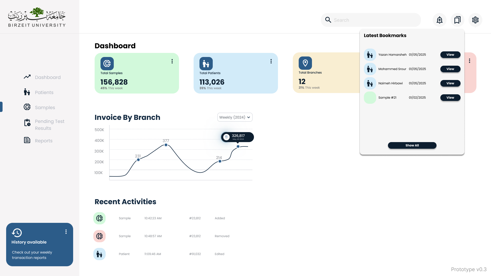
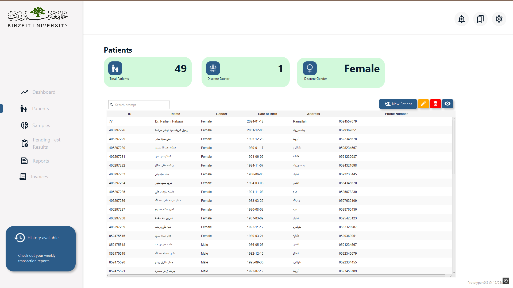
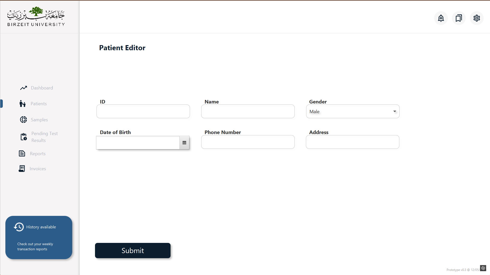
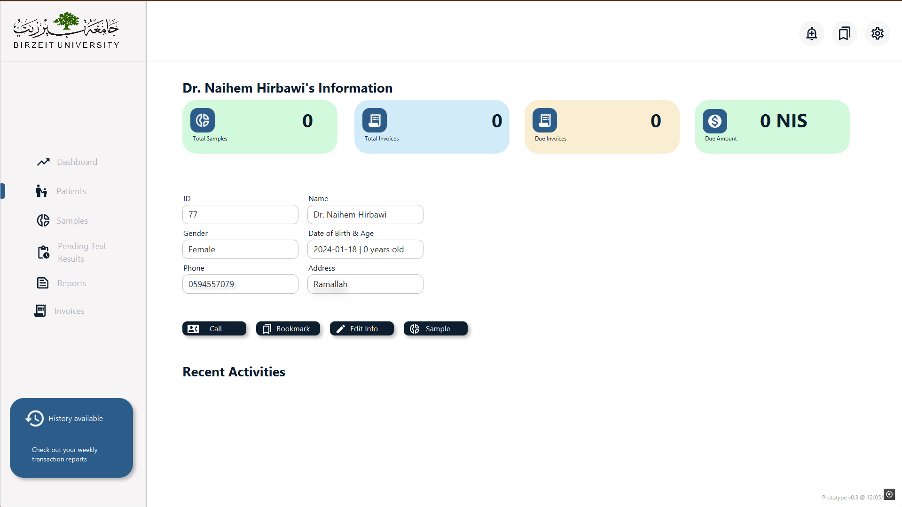
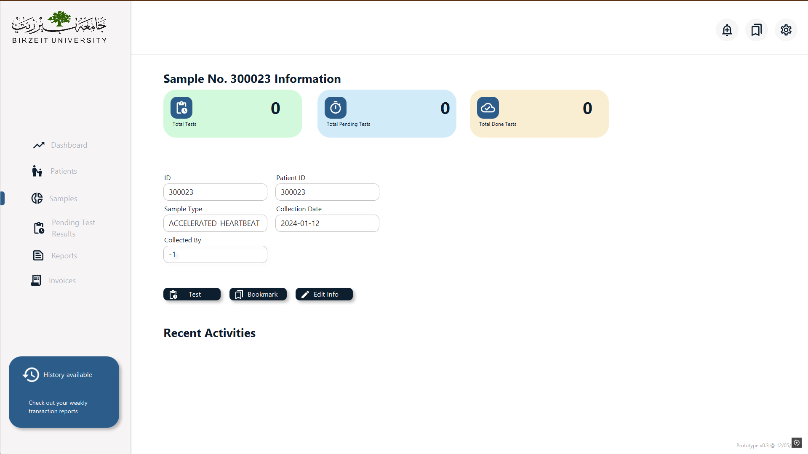
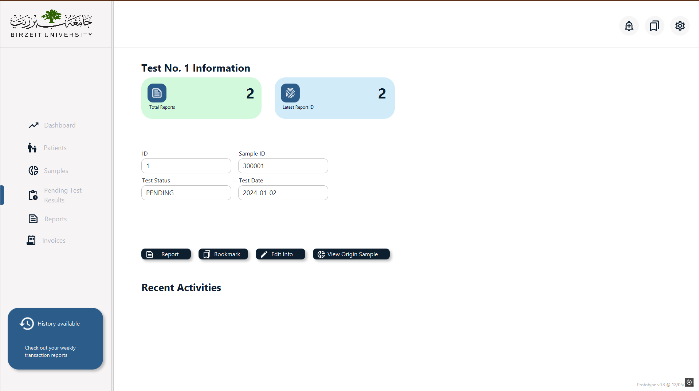
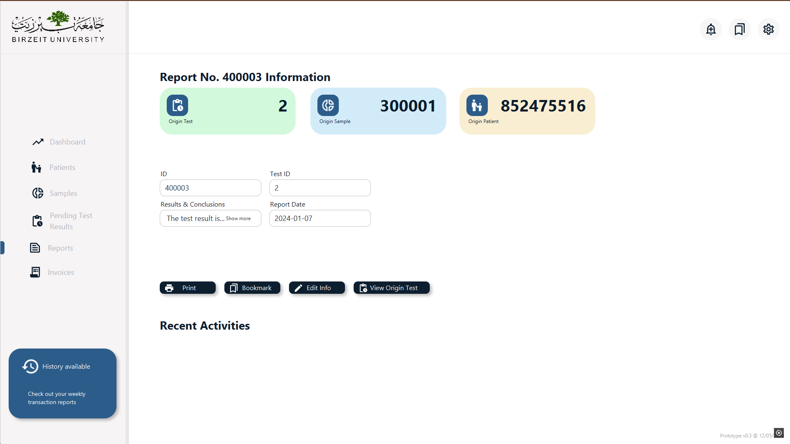
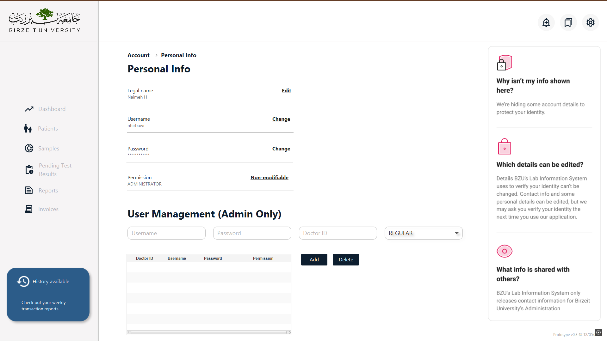

# Lab Information System

This project is developed as part of the **COMP333 - Database Management System** course. It is a comprehensive solution for managing medical laboratory operations, including the addition and management of patients, samples, tests, reports, and invoices.

## Key Feature: Bookmark System  

The **Bookmark Feature** allows users to easily save and access important items in the application.  

- Users can bookmark any object in the system, including **patients**, **samples**, **tests**, **reports**, and **invoices**.  
- Bookmarked items appear in a **dedicated dropdown menu** located in the top-right corner of the screen for quick access.  
- This feature helps users easily revisit items they plan to work on later.  

### Example Use Case:
If a user wants to edit a patient’s information at a later date, they can bookmark the patient. When needed, they can simply select the patient from the bookmarks menu and proceed to edit or view the details. This functionality is similar to the "favorite video" feature in TikTok, offering convenience and ease of use.  

---

## Features

- **User-Friendly Interface**  
  The user interface is visually appealing and fully designed in **Figma**, ensuring an intuitive and seamless user experience.  

- **Patient Management**  
  Add, update, and maintain records of patients efficiently.  

- **Sample and Test Management**  
  Track samples and associated tests, including their statuses and results.  

- **Report Generation**  
  Generate detailed reports for patients and tests.  

- **Invoice Management**  
  Manage and track invoices for all laboratory services.

- **User Personal Information**  
  Users can view and update their personal information through the interface.

- **Permissions System**  
  Two user roles are supported:
  - **Administrator**: Full control over the application, including the ability to modify all values.
  - **Regular User**: Restricted access, with permissions to modify only specific values.

## Technologies Used

- **Java**: Core programming language for application logic.  
- **MySQL**: Database system for storing and managing data.  
- **SceneBuilder**: Tool for designing JavaFX user interfaces.

## Installation and Setup

1. Clone this repository to your local machine.  
   ```bash
   git clone https://github.com/xdabdoub/Lab-Information-System
   ```
2. Add the charm-glisten-6.1.0 library to your project.
3. Launch the MySQL server on port 3306.
4. You're good to go now!

---

<details>
  <summary><h1>Screenshots</h1></summary>
  
1. Dashboard Screen

2. Patients

3. Patient Editor (Insert and Update)

4. Patient Viewer

5. Sample Viewer

6. Test Viewer

7. Report Viewer

9. Personal Info

